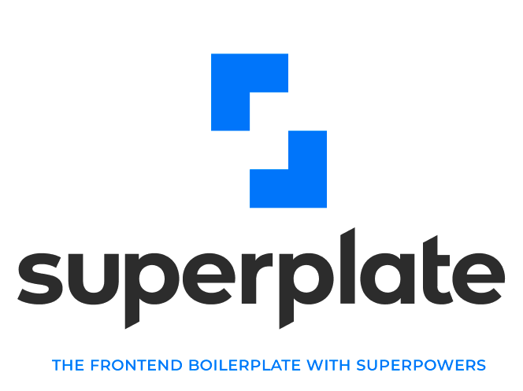

<br/>
<div align="center">Performance oriented UI Frameworks application boilerplate creator most popular tech-stack.</div>
<br/>


<div align="center">


[](https://meercode.io/pankod/superplate)
[](https://meercode.io/pankod/superplate)
[](https://david-dm.org/pankod/superplate)
[](https://david-dm.org/pankod/superplate?type=dev) 
[](https://travis-ci.org/pankod/superplate) 


</div>


<br/>
<div align="center">
  <sub>Created by <a href="https://www.pankod.com">Pankod</a></sub>
</div>


<div>
    
    
    

   

## About

superplate has been developed to create rock solid web app boilerplate by using most popular UI frameworks with no build configurations in seconds.

You can add usefull, highly-demands front-end development tools and libraries as a plugin by using superplate CLI during the project creation phase.

The default plugins determined by <a href="https://www.pankod.com">Pankod</a> team uses on a day-to-day basis to build apps.


To learn on how superplate and its plugins work, you can check out our documentation.


For now, project starter boilerplates only creating for Next.js apps as a default UI Framework option. Other frameworks integration will be added soon.

## Next.js Support

superplate  makes it easier to get up and running with a well-structured Next.js and TypeScript application.


Next.js is a minimalistic React framework that runs on the browser and the server  with all the features you need for production: hybrid static & server rendering, TypeScript support, smart bundling, route pre-fetching, and more. It offers developers an easy way to get started, build server-side rendering and static web applications using React.

The advantage of this approach is to be able to create rich user experiences in a uniform way, without compromising SEO (Search Engine Optimisation) factors that are key to good ranking on Google and other search engines.


<br/>


## Quick Start
To create a new app run the command:


```bash
npx superplate <my-project>
```
Make sure you have npx installed (npx is shipped by default since npm 5.2.0)

You will be prompted with plugin options to create your project without spending hours on configurations. To find out more about all the plugins see the [superplate-core-plugins](https://github.com/pankod/superplate-core-plugins).


<p align='center'>

</p>


Once all questions are answered, it will install all plugins and the dependencies. Then  navigate to the project folder and launch it:

```bash
npm run start
```

## Plugins
superplate comes with a set of plugins to get you started.

Plugins are created with most powerful development tools and libraries for populer UI Frameworks.

You can check them out in [superplate-core-plugins](https://github.com/pankod/superplate-core-plugins). 

### Using a custom source of plugins

You can use different sources for plugins other than [superplate-core-plugins](https://github.com/pankod/superplate-core-plugins). 

Simply add `--source <path-to-source>` option to use **superplate** with a custom source. 

To Learn more about sources and how to create your own; please check out [Documentation#creating-a-source-repository](X)

### Creating a plugin

**superplate** gives you many abilities to create your own plugin and interact with the others. To learn more on creating a plugin, please check out [Documentation#creating-a-plugin](X)

## Options

### `--source <path-to-source>`

Alias: `-s`. Use this option to target a custom source of plugins. Source path can be a remote git repository or a local path.

### `--version`

Alias `-v`. Prints version number.

### `--help`

Alias `-h`. Prints help information on all commands and options.

### `--debug`

Alias `-d`. Prints additional logs.

## Contribution

If you have a bug to report, do not hesitate to file an issue.

If you are willing to fix an issue or propose a feature; all PRs with clear explanations are welcome and encouraged.

## Development

### `npm run dev:global`

Watch for changes in the code; build the project and then globally install the superplate for testing.

### `npm run build:cli`

Create a build inside `/lib` directory.

### `npm run global`

Install the current build globally
