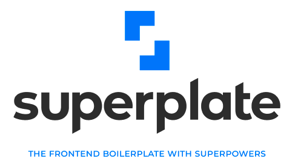

<div align="center">

</div>
<br/>
<div align="center">Performance oriented UI Frameworks application boilerplate creator with TypeScript using the popular front-end ecosystem tools.</div>
<br/>


<div align="center">


[](https://meercode.io/pankod/superplate)
[](https://meercode.io/pankod/superplate)
[](https://david-dm.org/pankod/superplate)
[](https://david-dm.org/pankod/superplate?type=dev) 


</div>


<br/>
<div align="center">
  <sub>Created by <a href="https://www.pankod.com">Pankod</a></sub>
</div>

   
## About


superplate has been developed to create rock solid UI frameworks apps boilerplate with no build configurations in seconds.

You can add usefull, highly-demands front-end development tools and libraries as a plugin by using superplate CLI during the project creation phase.


To learn on how superplate and its plugins work, you can check out our documentation.


For now, superplate only creates project starter boilerplates  for Next.js apps as a default UI Framework option. Other frameworks integration will be added soon.

## Available Integrations


## Coming Soon


## Quick Start
To create a new app run the command:


```bash
npx superplate <my-project>
```
Make sure you have npx installed (npx is shipped by default since npm 5.2.0)

You will be prompted with plugin options to create your project without spending hours on configurations. To find out more about all the plugins see the [superplate-core-plugins](https://github.com/pankod/superplate-core-plugins).


<p align='center'>

</p>


Once all questions are answered, it will install all plugins and the dependencies. Then  navigate to the project folder and launch it:

```bash
npm run dev
```
>Use the dev command when running application in development mode.
## Philosophy

- It provides a easy starting to your project in seconds with using industry-standard best practices and performance oriented tools & libraries.
- You can easily develop your own framework CLI and plugins according to your needs to on top of superplate codebase due to its framework/plugin agnostic nature.
- Code examples are added to plugin documents to show how best practices are implementing.

## Next.js Integration

superplate  makes it easier to get up and running with a well-structured Next.js and TypeScript application.


Next.js is a minimalistic React framework that runs on the browser and the server  with all the features you need for production: hybrid static & server rendering, TypeScript support, smart bundling, route pre-fetching, and more. It offers developers an easy way to get started, build server-side rendering and static web applications using React.

## Plugins
superplate uses a plugin-based architecture. Basically, plugins are created from highly-demanded npm tools in the front-end ecosystem with configuration files. 

The features and tools listed during the project creation process are implemented as plugins.

You can check them out in [superplate-core-plugins](https://github.com/pankod/superplate-core-plugins). 

The default core plugins determined by <a href="https://www.pankod.com">Pankod</a> team uses on a day-to-day basis to build apps. Feel free to send PR or open an issue for new plugins you want to add.


### Using a custom source of plugins

You can use different sources for plugins other than [superplate-core-plugins](https://github.com/pankod/superplate-core-plugins). 

Simply add `--source <path-to-source>` option to use **superplate** with a custom source. 

To learn more about sources and how to create your own; please check out [Documentation#creating-a-source-repository](X)

### Creating a plugin

**superplate** gives you many abilities to create your own plugin and interact with the others. To learn more on creating a plugin, please check out [Documentation#creating-a-plugin](X)


## Avaliable plugins


## CLI options

```
> npx superplate --help
Usage: superplate [options]

Options:
 -v, --version                   prints version number
 -h, --help                      prints help information on all commands and options
 -d, --debug                     prints additional logs
 -s, --source <path-to-source>   Use this option to target a custom source of plugins 
                                 Source path can be a remote git repository or a local path.  
```


## Development mode commands


Watch for changes in the code; build the project and then globally install the superplate for testing.
```
npm run dev:global
```

Create a build inside `/lib` directory.

 ```
 npm run build:cli
 ```


Install the current build globally


```
npm run global
```


## Contribution

If you have a bug to report, do not hesitate to file an issue.

If you are willing to fix an issue or propose a feature; all PRs with clear explanations are welcome and encouraged.

## License

Licensed under the MIT License, Copyright © 2021-present Pankod
