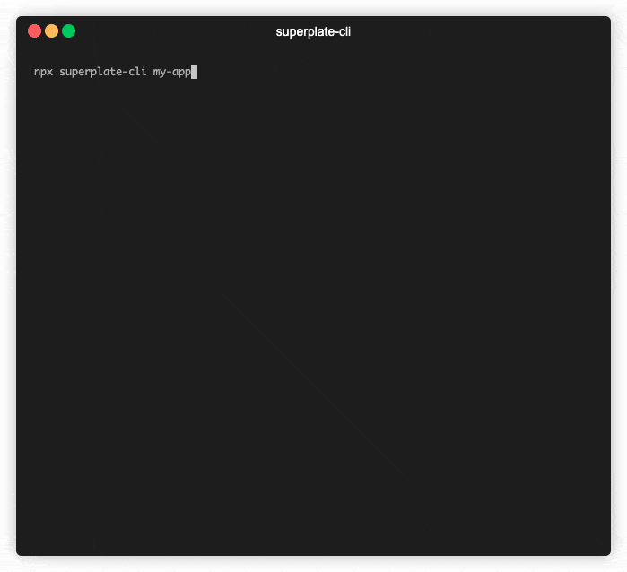
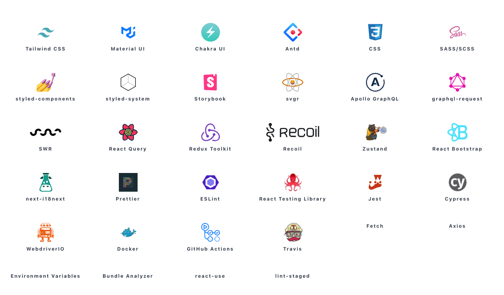

<div align="center">
<a href="https://pankod.github.io/superplate/">
  
</a>
</div>
<br/>
<div align="center">A well-structured production-ready frontend boilerplate with Typescript, Jest, testing-library, styled-component, Sass, Css, .env, Fetch, Axios, Reverse Proxy, Bundle Analyzer and 30+ plugins. For now, it only creates projects for React and Next.js.</div>
<br/>

<div align="center">

<a href="https://www.producthunt.com/posts/superplate?utm_source=badge-featured&utm_medium=badge&utm_souce=badge-superplate" target="_blank"></a>

[](https://meercode.io/)
[](https://meercode.io/)
[](https://codeclimate.com/github/pankod/superplate/maintainability)
[](https://www.npmjs.com/package/superplate-cli)
[](https://david-dm.org/pankod/superplate)
[](https://david-dm.org/pankod/superplate?type=dev)

[](https://www.npmjs.com/package/superplate-cli)

</div>

<br/>
<div align="center">
  <sub>Created by <a href="https://www.pankod.com">Pankod</a></sub>
</div>

## About

Superplate lets you start rock-solid, production-ready *React* and *Next.JS* projects just in seconds. The command-line interface guides the user through setup and no additional build configurations are required.

Superplate ships with more than 30 plugins including popular UIKits, testing frameworks and many useful developer tools.

## Available Integrations
<a href="https://pankod.github.io/superplate/docs/">
  
</a>

<br />
<br />

## Coming Soon

<a href="https://pankod.github.io/superplate/docs/">
  
</a>

<br />
<br />

## Documentation

For more detailed information and usage, you may refer to our [documentation pages](https://pankod.github.io/superplate/).

## Quick Start

To use superplate, make sure you have *npx* is installed on your system (npx is shipped by default since npm 5.2.0).

To create a new app, run the following command:   

```bash
npx superplate-cli <my-project>
```

You will be prompted with plugin options to create your project. A full list of avaiable plugins is here: [superplate-core-plugins](https://github.com/pankod/superplate-core-plugins).

<p align='center'>

</p>

Once all questions are answered, superplate will install all plugins and dependencies. Then navigate to the project folder and launch it:

```bash
npm run dev
```

> Use the dev command when running application in development mode.

## Philosophy

-   It provides an easy starting to your project by leveraging industry-standard best practices and and performance oriented tools.
-   Fully extensible due its plugin based architechture.
-   Code examples are added to plugin documents to show how best practices are implemented.

## refine Integration

[refine](https://github.com/pankod/refine) is a React framework for building internal tools rapidly.

[refine](https://github.com/pankod/refine) offers lots of out-of-the box functionality for rapid development, without compromising extreme customizability. Use-cases include, but are not limited to admin panels, B2B applications and dashboards.

## Next.js Integration

superplate makes it easier to get up and running with a well-structured Next.js and TypeScript application.

Next.js is a minimalistic React framework that runs on the browser and the server with all the features you need for production: hybrid static & server rendering, TypeScript support, smart bundling, route pre-fetching, and more. It offers developers an easy way to get started, build server-side rendering and static web applications using React.

## React Integration

superplate makes it easier to get up and running with a well-structured Create React App and TypeScript application.

## Plugins

superplate uses a plugin-based architecture. Basically, plugins are created from popular npm tools with configuration files. You can check them out in [superplate-core-plugins](https://github.com/pankod/superplate-core-plugins).

The default core plugins determined by <a href="https://www.pankod.com">Pankod</a> team. Feel free to send PR or open an issue for new plugins you want to add.

### Using a custom source of plugins

You can use different sources for plugins other than [superplate-core-plugins](https://github.com/pankod/superplate-core-plugins).

Simply add `--source <path-to-source>` option to use **superplate** with a custom source.

To learn more about sources and how to create your own; please check out [documentation](https://pankod.github.io/superplate/docs/development/how-it-works/#creating-a-source-repository)

### Creating a plugin

**superplate** gives you many abilities to create your own plugin and interact with the others. To learn more on creating a plugin, please check out [documentation](https://pankod.github.io/superplate/docs/development/creating-a-plugin)

## Available plugins



## CLI options

```
> npx superplate-cli --help
Usage: superplate [options]

Options:
 -v, --version                   prints version number
 -h, --help                      prints help information on all commands and options
 -d, --debug                     prints additional logs
 -s, --source <path-to-source>   Use this option to target a custom source of plugins
                                 Source path can be a remote git repository or a local path.
```

## Development mode commands

Watches for changes in the code; builds the project and then globally installs  superplate for testing.

```
npm run dev:global
```

Create a build inside `/lib` directory.

```
npm run build:cli
```

Install the current build globally:

```
npm run global
```

## Contribution

If you have a bug to report, do not hesitate to file an issue.

If you are willing to fix an issue or propose a feature; all PRs with clear explanations are welcome and encouraged.

## License

Licensed under the MIT License, Copyright © 2021-present Pankod
